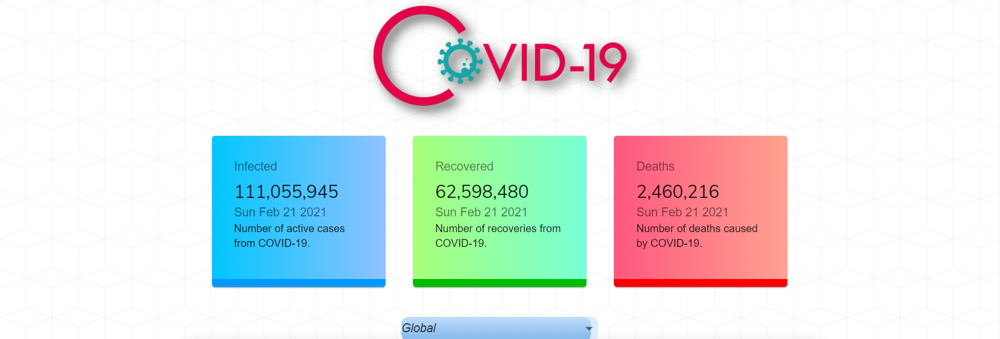
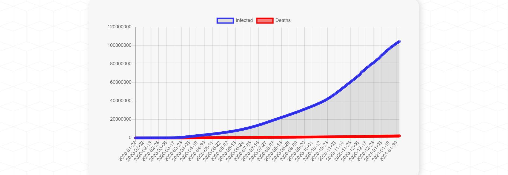
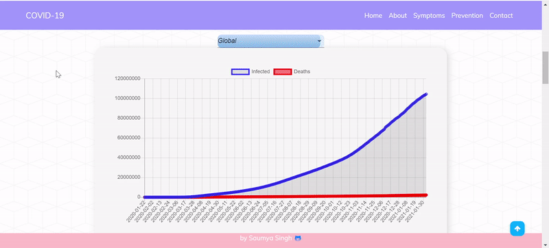

# COVID-19 Tracker

This is a live Covid Tracking Web Application built using React.js to track the impact of Covid all over the world by fetching and displaying the current
statistics and a graphical representation of the data. The website displays the option to check the current number of New Cases, Recoveries, and Deaths.

</img>
</img>
</img>
</img>

<br>
<br>
<br>

A gif demonstrating how data from different countries is fetched and displayed.
<br>
<br>


API used: https://covid19.mathdro.id/api

Setup:
- run ```npm i && npm start```
